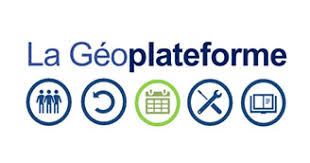

# Site de documentation

---

## Sommaire
- [Définition](#definition)
- [Sources internes](#sources-internes)
  - [Référentiel parcellaire interne](#referentiel-parcellaire-interne)
  - [Référentiel BD TOPO](#referentiel-bd-topo)
  - [Géoplateforme](#geoplateforme)
- [Sources externes](#sources-externes)
  - [INSEE](#insee)
  - [Urbansimul](#urbansimul)
  - [OpenStreetMap (OSM)](#osm)
- [Recommandations](#recommandations)

---

## Définition
Une **source de données** est l’origine d’une information exploitable dans un système d’information.  
Elle peut être **interne ou externe**, **structurée ou non structurée**, **statique ou temps réel**.  

**Objectif** : garantir **fiabilité**, **traçabilité**, **fraîcheur** et **exploitabilité**.

---

## Sources internes
Dans la DDT, les sources internes sont principalement des **référentiels** utilisés dans les missions quotidiennes.  

### Référentiel parcellaire interne
- **Type** : vectoriel (polygones parcelles)  
- **Format** : Shapefile, GeoJSON  
- **Mise à jour** : mensuelle  
- **Licence / Usage** : interne DDT uniquement  
- **Exemple d’usage** : analyse foncière et attribution de parcelles à des projets.

### Référentiel BD TOPO
- **Type** : vectoriel (routes, bâtiments, hydrographie…)  
- **Format** : Shapefile, GPKG  
- **Mise à jour** : trimestrielle  
- **Licence / Usage** : usage officiel pour SIG  
- **Exemple d’usage** : cartographie et planification territoriale.

### Géoplateforme
  
- **Type** : multi-données SIG  
- **Format** : WMS, WFS, GeoJSON  
- **Accès** : [Lien Géoplateforme](https://www.ign.fr/geoplateforme)  
- **Usage** : intégration centralisée des données internes et externes  
- **Exemple d’usage** : extraction rapide de données par zone d’intérêt.

---

## Sources externes
Les sources externes viennent d’institutions ou plateformes publiques/privées.  

### INSEE
  
- **Type** : tabulaire/statistique  
- **Format** : CSV, XLS  
- **Mise à jour** : annuelle ou trimestrielle selon l’indicateur  
- **Licence / Usage** : ouverte (Open Data)  
- **Exemple d’usage** : indicateurs démographiques et socio-économiques.

### Urbansimul
  
- **Type** : foncier, simulation urbaine  
- **Format** : CSV, API interne  
- **Licence / Usage** : usage interne pour simulation de projets urbains  
- **Exemple d’usage** : analyse d’impact foncier et urbanistique.

### OpenStreetMap (OSM)
  
- **Type** : vectoriel (points, lignes, polygones)  
- **Format** : .osm, GeoJSON  
- **Mise à jour** : continue, contribution collaborative  
- **Licence / Usage** : ODbL  
- **Exemple d’usage** : cartographie libre, réseau routier, points d’intérêt.

 _________________________________________

 # Interopérabilité - Web Services 

## 1. Contexte général : interopérabilité = FAIR
- Objectif : rendre les données **Findable, Accessible, Interoperable, Reusable**.
- Approche clé pour diffuser des données géospatiales dans des systèmes hétérogènes.

## 2. Web Services OGC
Les principaux services :

| Service | Type de données | Usage principal |
|---------|----------------|----------------|
| **WMS** (Web Map Service) | Image/cartes | Produire et afficher des cartes via HTTP |
| **WMTS** (Web Map Tile Service) | Image/cartes tuilées | Affichage rapide et scalable |
| **WFS** (Web Feature Service) | Vectoriel | Accès aux données vectorielles (features) |
| **WCS** (Web Coverage Service) | Raster/couvertures | Accès aux données raster et valeurs attributaires |
| **CS-W** (Catalogue Service for the Web) | Métadonnées | Recherche et découverte de données géospatiales |
| **WPS** (Web Processing Service) | Traitement géospatial | Exposition de traitements comme buffer, overlay, etc. |

- Ces services sont accessibles via **HTTP/URL**, compatibles avec des clients SIG tels que QGIS, ArcGIS ou OpenLayers.

## 3. Formats et standards associés
- **SLD** : Styled Layer Descriptor (styles des couches)
- **GML** : Geography Markup Language (modèle géométrique et attributaire)
- **KML** : Keyhole Markup Language (visualisation type Google Earth)
- **GPKG** : GeoPackage (conteneur de données géospatiales)
- **WKT CRS** : Notation des systèmes de référence

## 4. Évolution des normes
- Les Web Services OGC classiques (WMS, WFS, WCS, etc.) restent des piliers.
- Tendances modernes : **OGC API** (REST/JSON), qui reprennent les mêmes concepts pour plus de légèreté et compatibilité web.

## 5. Examen des webservices avec QGIS

## a. Exemple pratique
- Utilisation de QGIS pour observer un service WMTS.
- Accès à la capacité du service via un **GetCapabilities** en XML :  [getcapabilities]
  (https://data.geopf.fr/wmts?SERVICE=WMTS&VERSION=1.0.0&REQUEST=GetCapabilities).

## b. Avantages fondamentaux des Web Services
- **Mise à disposition globale et contrôlée** des données spatiales.
- **Performance côté client** grâce à un temps de chargement réduit.
- **Interopérabilité** entre différents outils SIG.

## 6 . Catalogage et Métadonnées : Principes Clés

## Objectif
Permettre le partage et la réutilisation de données fiables dans la discipline de la géomatique.

## a. Caractéristiques des données de qualité.
- **Exhaustives** : couverture complète des informations nécessaires.  
- **Propres** : sans erreurs ou incohérences.  
- **Géométriquement correctes** : respect des standards géospatiaux.  

## b. Documentation et standards
- Fiches de métadonnées conformes aux normes **ISO 19115 / 19139**, **INSPIRE**, **DCAT**.  

## c. Diffusion et accessibilité
- Catalogues de données et métadonnées.  
- Services web de catalogage (**CSW**).  

## d. Réutilisabilité
- Données accessibles et ouvertes pour exploitation ultérieure.

## 7. ETL Spatial – Synthèse

## a. Définition générale
L’ETL (Extract, Transform, Load) spatial, ou GTL (« Geographic Transformation and Load »), applique les principes classiques d’ETL aux données géographiques.

## b. Étapes clés
- **Extract (Extraction)** : Convertir les données dans un format adapté à la transformation.  
- **Transform (Transformation)** :  
  - Nettoyage, filtrage, enrichissement  
  - Division (splitting) et regroupement  
  - Restructuration des données pour le modèle cible (structure, attributs, géométrie)  
- **Load (Chargement)** : Intégrer les données transformées dans la base cible.  

## c. Fonctions principales de l’ETL spatial
- Synchronisation de bases de données géographiques  
- Conversion de formats (ex. OGR / GDAL)  
- Restructuration complète du modèle de données  

## d. Transformations géospatiales courantes
- **Reprojection** : Changement de système de coordonnées  
- **Transformations spatiales** : Calcul de relations et prédicats spatiaux  
- **Transformations topologiques** : Création de relations topologiques entre jeux de données  
- **Re-symbolisation** : Modification de l’apparence cartographique (couleur, style)  
- **Géocodage** : Conversion d’attributs tabulaires en données spatiales  

## e. Exemple d’application
- Calcul d’indicateurs NDVI, EVI et LAI via un processus ETL spatial